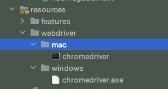
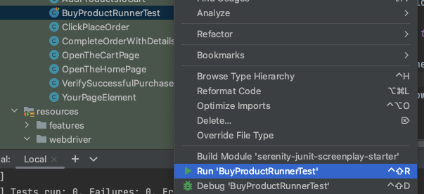
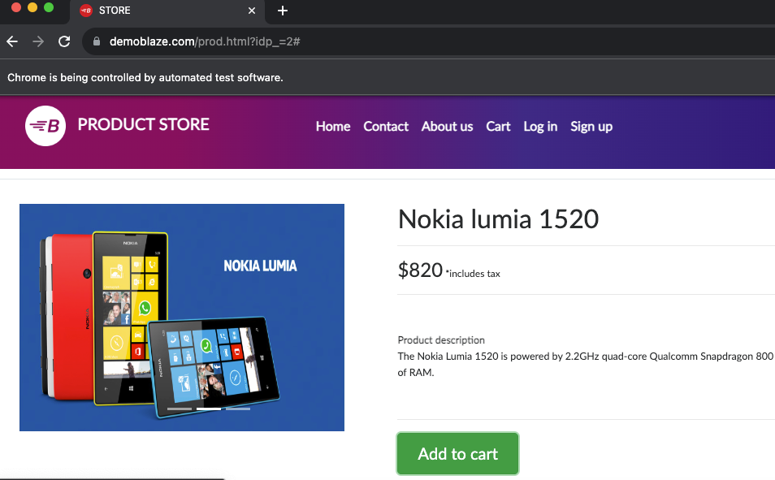
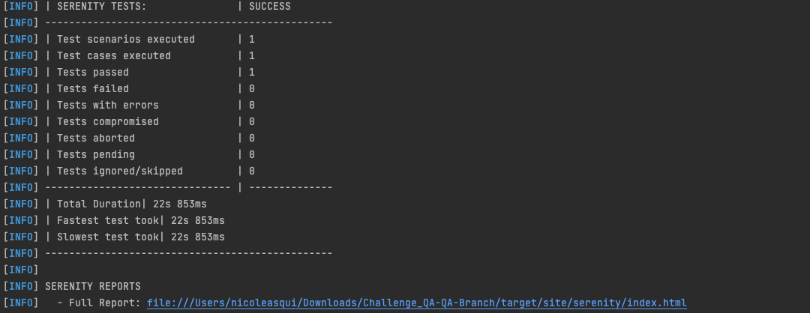
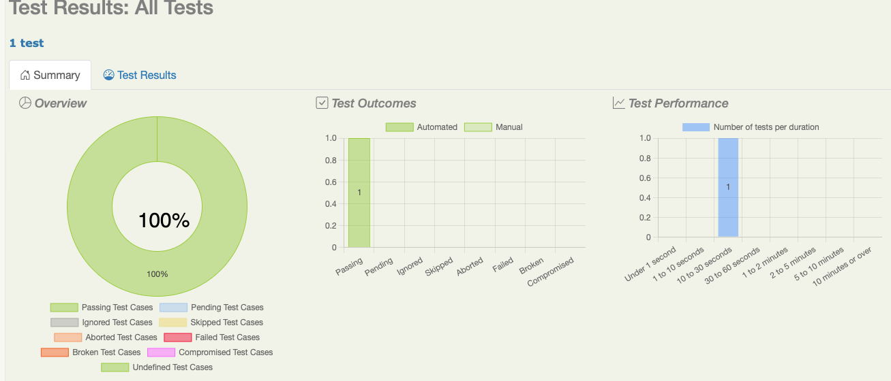
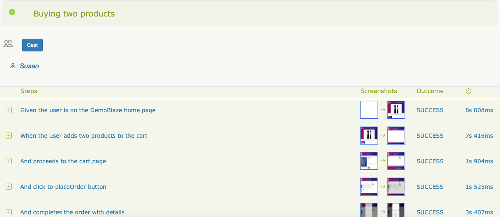
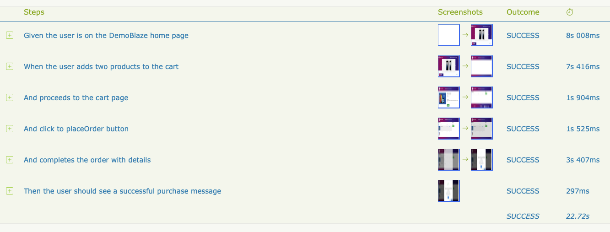

# Serenity BDD Challenge QA

This project was developed on a MacOs:

- JDK version 11.0
- Serenity 3.5
- Maven version 3.9.3
- IntelliJ IDE version 2023

## Use Maven to run test 
Before running the test, you must download the driver compatible with your chrome browser, I can not attach it because of the weight, but you can download it at this link https://sites.google.com/chromium.org/driver/ verifies that the driver is compatible with your operating system and your chrome, in this case I am using

In the resources folder you can find the folders for mac and windows, add there your driver

If you use a device other than mac, change the path to the UserStepDefinitions.java file on line 20

First we must run the test

Clicking on the test will start the implemented navigation.

Then open a terminal and run:

    mvn verify

Finally, you can see the report if you clicked in that link

## Viewing the reports

The command provided above will produce a Serenity test report in the `target/site/serenity` directory. Go take a look!

 

## Findings and Conclusions

Informe de Hallazgos y Conclusiones del Ejercicio de Automatización de Pruebas con Serenity BDD y Cucumber

En el marco del ejercicio de automatización de pruebas utilizando las herramientas Serenity BDD y Cucumber, se llevaron a cabo una serie de actividades para probar la aplicación web DemoBlaze. A continuación, se presentan los principales hallazgos y conclusiones derivados de este ejercicio:

## Hallazgos:

Configuración Exitosa: Se logró una configuración exitosa del proyecto de automatización, incluyendo las dependencias necesarias y los plugins de Maven para integrar Serenity BDD y Cucumber en el flujo de trabajo de pruebas.

Interacciones con la Aplicación: Se implementaron escenarios de prueba que abarcan diversas interacciones con la aplicación web, como la navegación por páginas, la adición de productos al carrito y la realización de una orden. Estos escenarios demuestran la capacidad de las herramientas para simular acciones de usuarios reales.

Generación de Informes Detallados: El plugin serenity-maven-plugin se configuró adecuadamente para generar informes detallados después de la ejecución de las pruebas. Estos informes incluyen capturas de pantalla, datos de prueba y estadísticas, lo que brinda una visión completa del estado de las pruebas.

## Conclusiones:

Aprendizaje de BDD: La implementación de pruebas utilizando la metodología BDD con Cucumber y Serenity BDD proporcionó una experiencia valiosa en la escritura de pruebas en un lenguaje natural. Esto contribuye a una comunicación más clara entre los miembros del equipo.

Eficiencia en Automatización: La automatización de pruebas con estas herramientas demostró su capacidad para aumentar la eficiencia y consistencia de las pruebas. Las acciones automatizadas pueden repetirse sin errores humanos y brindar resultados confiables.

Comunicación y Colaboración: Los informes generados por Serenity BDD y la legibilidad de las pruebas escritas en Cucumber facilitan la comunicación y colaboración entre los equipos de desarrollo y pruebas. Todos los miembros del equipo pueden entender los escenarios y resultados de prueba.

Identificación de Problemas: Los informes detallados generados permiten la identificación temprana de áreas problemáticas y posibles fallas en la aplicación. Esto es esencial para garantizar la calidad del software y acelerar la corrección de problemas.

Mejora Continua: La automatización de pruebas es un proceso en constante evolución. A medida que se siga trabajando con estas herramientas, se pueden aplicar lecciones aprendidas para expandir la cobertura de pruebas y mantener la eficacia de las mismas.